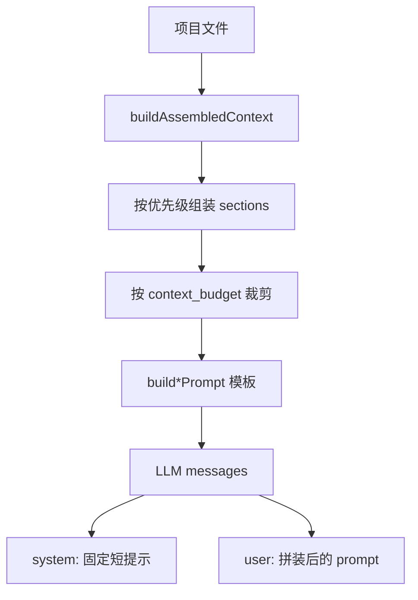
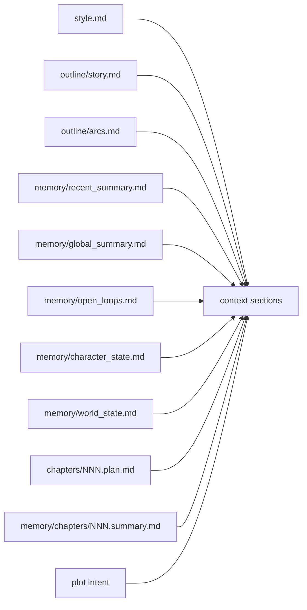
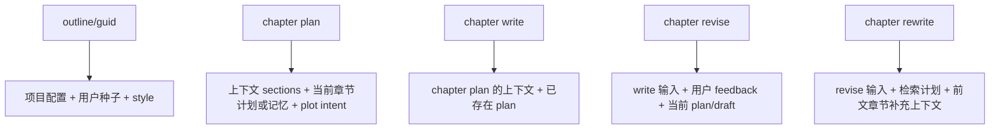
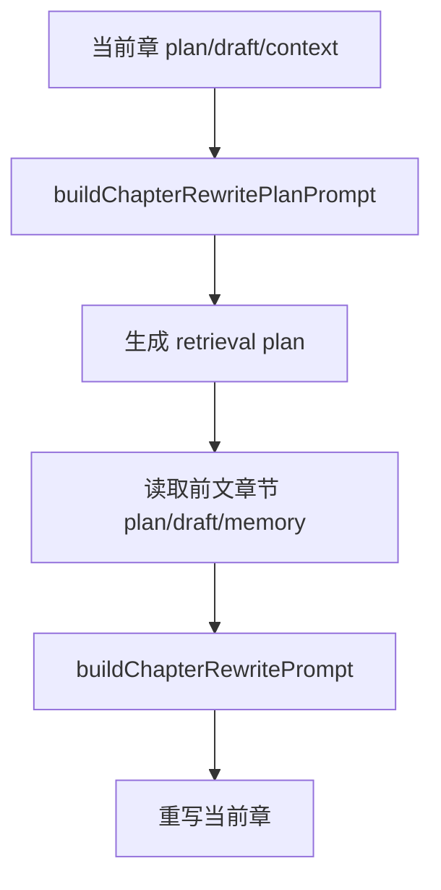

# Prompt Input Flow

本文说明 `ainovel` 在大纲、章节计划、正文写作、修订、重写时，如何组装输入给模型，以及上下文如何受 token 预算影响。

## 总体链路

固定 `system` 消息在 [`src/lib/llm.js`](/Users/yulan233/Desktop/project/ai_project/ainovel/src/lib/llm.js)。主要变化都发生在 `user` prompt。

## 上下文来源

对应实现：
- 上下文装配：[`src/lib/memory.js`](/Users/yulan233/Desktop/project/ai_project/ainovel/src/lib/memory.js)
- 意图补充：[`src/lib/cli.js`](/Users/yulan233/Desktop/project/ai_project/ainovel/src/lib/cli.js)
- Prompt 模板：[`src/lib/prompts.js`](/Users/yulan233/Desktop/project/ai_project/ainovel/src/lib/prompts.js)

## Token 预算与裁剪

- 预算来自 `project.yaml` 的 `context_budget`，默认 `12000`
- 实际裁剪使用近似估算：`ceil(text.length / 3)`
- 优先级顺序：`required > high > medium > low`
- 超预算时，`story`、`arcs`、`global_summary`、`style` 优先压缩为前 6 行
- 还超预算则直接不放入 prompt

TUI 里的 token 显示使用 [`src/lib/token.js`](/Users/yulan233/Desktop/project/ai_project/ainovel/src/lib/token.js) 的 `js-tiktoken` 精确计数，但这主要用于展示，不是实际裁剪逻辑。

## 各命令的输入变化

### 1. `outline` / `guid`

输入较轻，主要由以下内容组成：
- 项目配置：标题、类型、目标篇幅
- 用户要求或引导式问答结果
- `style.md`
- 可选的 plot intent

输出目标是四块大纲：`story`、`arcs`、`characters`、`world`。

### 2. `chapter plan`

输入切到“结构规划”模式，重点是：
- 当前章节计划
- 当前章节记忆
- 近期记忆
- 人物状态、世界状态
- 未回收伏笔、剧情线索、连续性提醒
- 故事总纲、卷纲、全局记忆、文风
- 剧情意图

模板要求输出 frontmatter 和场景拆分，强调连续性、推进和章末钩子。

### 3. `chapter write`

与 `chapter plan` 共用大部分上下文，但用途改为正文生成：
- 通常已经存在本章 `plan`
- Prompt 规则更强调动作、冲突、对白、章末驱动力
- 会显式禁止“以下是”“我将”“作为 AI”这类元叙述

写完后会更新记忆聚合文件，因此下一章输入会随之变化。

### 4. `chapter revise`

在 `write` 的基础上再加入：
- 用户反馈
- 当前 plan 正文
- 当前 draft 正文

目标是做“最小破坏”的修订，而不是默认整章重写。

### 5. `chapter rewrite`

这是最重的一类输入，分两步：

1. 先生成检索计划  
2. 再把指定前文章节的 `plan`、`draft`、`memory` 补充进 prompt

这样 `rewrite` 比普通 `write` 多了一层“定向回查前文”，更适合修承接、伏笔、信息顺序和动机链。

## 一句话理解

- `outline`：吃设定种子
- `plan`：吃全局结构和当前状态
- `write`：吃章节计划和当前状态
- `revise`：再加用户反馈
- `rewrite`：再加前文检索结果
